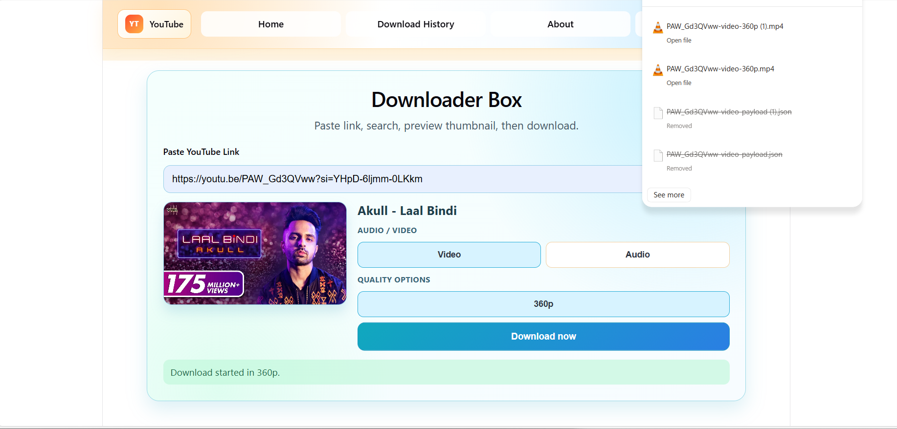
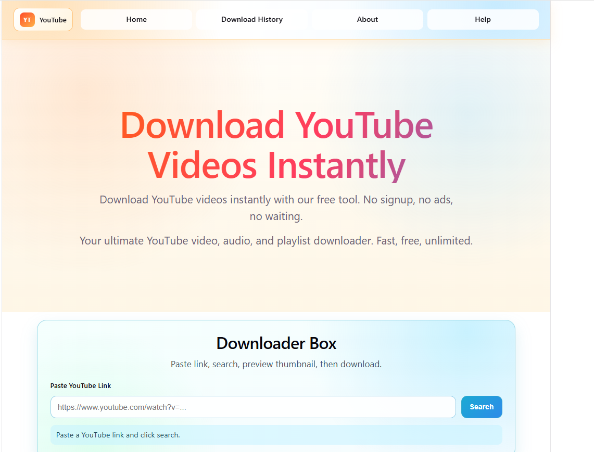

# YouTube Downloader (React + Django)

A full-stack YouTube downloader with:
- React (Vite) frontend for URL input, thumbnail preview, format selection, and download.
- Django backend using `yt-dlp` for metadata extraction and media download streaming.

## Highlights

- Supports video and audio downloads.
- Dynamic quality options from YouTube format data.
- Direct file download from browser (via backend streaming endpoint).
- Cookie-based authentication support for videos that require sign-in.
- Fallback video strategy when `ffmpeg` is not available on the server.
- Optional signed local-helper payload API (`/api/yt/local-job`) for advanced integrations.

## Screenshots



*Figure 1: Main download workflow*



*Figure 2: Format and quality selection*

## Tech Stack

- Frontend: React 19, Vite 8
- Backend: Django 5.2, yt-dlp
- Python dependencies: `django-cors-headers`, `gunicorn`

## Repository Structure

```text
Youtube/
  backend/
    downloading/
      downloading/          Django project settings and root URLs
      yt/                   YouTube API app (health, info, download, local-job)
      local_helper.py       Optional CLI helper for signed payload execution
      requirements.txt
  frontend/
    ui/
      src/                  React application
      vite.config.js
      package.json
```

## Prerequisites

- Node.js 18+ and npm
- Python 3.10+
- `ffmpeg` (recommended for best video quality merging)

## Local Setup

### 1) Backend (Django)

```bash
cd backend/downloading
python -m venv .venv
# Windows PowerShell:
.venv\Scripts\Activate.ps1
# macOS/Linux:
# source .venv/bin/activate

pip install -r requirements.txt
copy .env.example .env
# macOS/Linux: cp .env.example .env

python manage.py migrate
python manage.py runserver 127.0.0.1:8000
```

### 2) Frontend (Vite)

```bash
cd frontend/ui
npm install
copy .env.example .env.local
# macOS/Linux: cp .env.example .env.local

npm run dev
```

Frontend default URL: `http://localhost:5173`  
Backend default URL: `http://127.0.0.1:8000`

## Environment Variables

### Backend (`backend/downloading/.env`)

- `DJANGO_DEBUG`: `true` or `false`
- `DJANGO_SECRET_KEY`: Django secret key
- `DJANGO_ALLOWED_HOSTS`: Comma-separated host list
- `CORS_ALLOWED_ORIGINS`: Comma-separated origins
- `CORS_ALLOWED_ORIGIN_REGEXES`: Comma-separated regex patterns
- `CSRF_TRUSTED_ORIGINS`: Comma-separated trusted origins
- `YT_DL_BROWSER`: Browser name for cookie extraction (`chrome`, `firefox`, `brave`, `edge`, `safari`, `chromium`)
- `YT_DL_BROWSER_PROFILE`: Optional browser profile name
- `YT_DL_COOKIES_B64`: Base64-encoded `cookies.txt` content
- `YT_DL_COOKIES_RAW`: Raw `cookies.txt` content
- `YT_DL_COOKIES_FILE`: Absolute path to `cookies.txt`
- `YT_LOCAL_HELPER_SIGNING_KEY`: Optional signing key for local-helper payloads

### Frontend (`frontend/ui/.env.local`)

- `VITE_API_BASE_URL`: Backend base URL (example: `http://127.0.0.1:8000`)

## API Overview

Base path: `/api/yt`

- `GET /health` -> service health
- `GET /info?url=<youtube-url>` -> metadata + available qualities
- `GET /download?url=<youtube-url>&type=video|audio&quality=<value>` -> file stream download
- `GET /local-job?...` -> signed payload for local helper usage

A short API quick-reference is available in [API_NOTE.md](API_NOTE.md).

## Authentication and Bot-Check Handling

Some videos require authentication and may return errors like "Sign in to confirm you're not a bot".

Recommended approach:
- Local development: browser cookie extraction (`YT_DL_BROWSER=chrome`, etc.)
- Production: provide a valid `cookies.txt` using `YT_DL_COOKIES_B64`, `YT_DL_COOKIES_RAW`, or `YT_DL_COOKIES_FILE`

Detailed guide: [backend/downloading/AUTHENTICATION_GUIDE.md](backend/downloading/AUTHENTICATION_GUIDE.md)

## Deployment Notes

- You can deploy frontend and backend as separate projects (see [DEPLOY_VERCEL.md](DEPLOY_VERCEL.md)).
- Long-running video downloads may exceed serverless execution limits on some platforms.
- For heavy download traffic, a VM/VPS backend is more reliable.

## Legal and Usage Notice

Use this project only for content you are authorized to download and in compliance with local laws and platform terms.

## License

MIT
